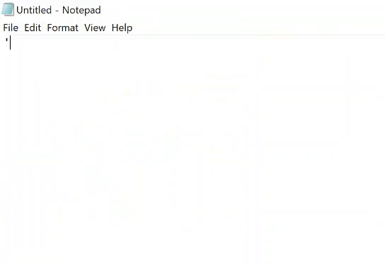

# TypingComposer
Powershell Based Programming/Script typing composer inspired by Bisqwit
https://www.youtube.com/results?search_query=bisqwit

## Getting Started

I wanted to learn powershell and I was fascinated by Bisqwit's autotyper so I created this.

### Prerequisites

Powershell Version: 5.1.17763.503

### Installing

```
git clone "https://github.com/phcreery/TypingComposer.git"
```

## Running

Run Powershell script hoever you perfer. (Rigth Click > Run with Powershell it is easiest)


1. Copy your code into the same directory and rename it to: input.txt
2. Execute Script
3. Editor will open, annotate it. (See Usage)
4. Save and close it
  4. Be sure all notepad windows are closed
5. Press Enter to Continue
6. Follow Direcitons and press enter again.
7. Relax



### Usage

Example markup:

```
1>	'''
	This is an example script to showcase TUI
	'''
<	
2	import tui
3	
5>	screensize = tui.getsize()
<	
4>-	r = tui.kbdinput("Prompt",screensize,"small","")
<	
6	print(r)
7
```
```
1 : Order of lines to draw
> : Continue writing this section
< : Stop writing this section
- : Write without autoclose parentheses/brackets/braces. ex. print(" dont autoclose this single brace { ")
```


## Goals
This is the list of future changes:

 - [ ] Intelligent Copy/Paste


## Authors

* **Peyton Creery** - *Initial work* 
